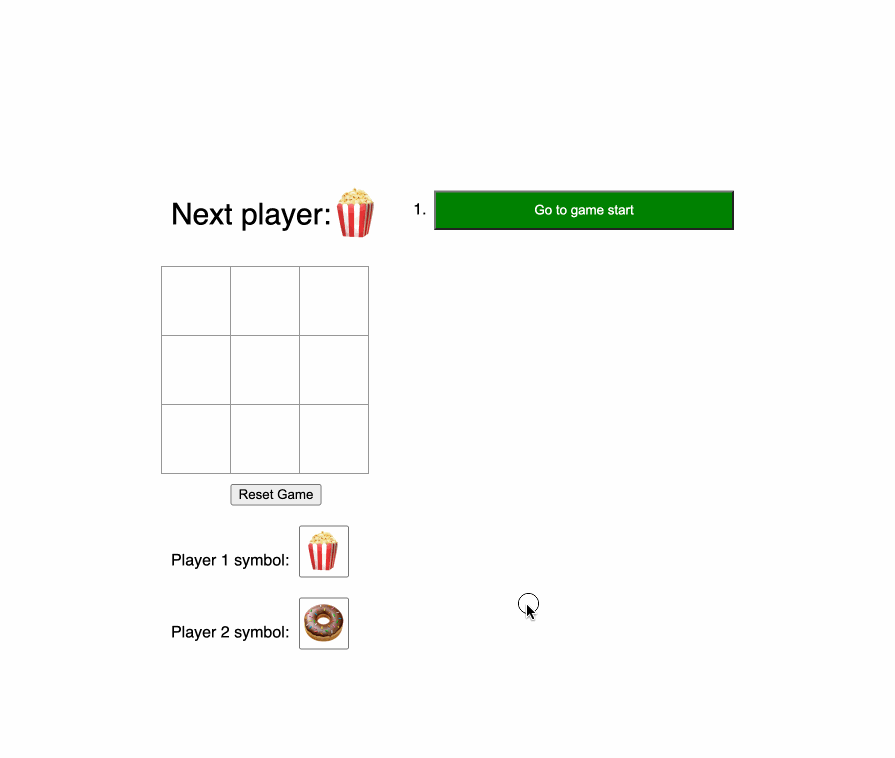

# Exploring react

I've been a long time vue user, but my current company uses react for the front end. I've kind of been avoiding learning
react up util this point, but considering I'm going to rewrite a front end client for a personal project I figured I
should bite the bullet and start learning react.

I'm following
the [legacy react tutorial](https://legacy.reactjs.org/tutorial/tutorial.html#inspecting-the-starter-code). Oof I didn't
realize I was following a legacy tutorial until writing this line. Looks
like [the current version of the tutorial](https://react.dev/learn/tutorial-tic-tac-toe) has some updated concepts,
soooooooooooo I guess I'm branching and redoing the tutorial :facepalm:.

I did all of the tutorial, the extra credit, and a couple of additions I just felt like popping in to explore some
aspects of react that I know exist but weren't covered by the tutorial.

There's def some cleanup that could be done, some abstraction and extraction, bug fixes (e.g. updating the player
symbols after play has begun doesn't change the symbols already in the grid). That said, it's just a get-my-feet-wet
demo so I'm not really worried about the sloppy parts. I learned the stuff I wanted to learn :)